# 🍔 LemBox

> Sistema POS SaaS Multi-Tenant para restaurantes de hamburguesas

LemBox es una plataforma POS moderna diseñada para digitalizar la gestión integral de restaurantes de hamburguesas. Su arquitectura multi-tenant permite que múltiples negocios operen de forma completamente aislada, segura y escalable dentro del mismo sistema.

El sistema cubre todo el flujo operativo: catálogo, ingredientes, inventario, compras, recetas, órdenes, ventas, reportes, usuarios y suscripciones.

---

## 🚀 Demo en vivo

🌐 https://burger-front.vercel.app

Explora LemBox en funcionamiento: gestión de pedidos, inventario, catálogo y reportes en un entorno real.

---

## ✨ Características principales

- SaaS Multi-Tenant con aislamiento total por negocio
- Autenticación segura con JWT
- Gestión de usuarios y roles por negocio
- Catálogo de hamburguesas basado en recetas
- Gestión de ingredientes e inventario automatizado
- Compras con actualización automática de stock
- Gestión completa de órdenes (ciclo de vida completo)
- Ventas derivadas de órdenes pagadas
- Reportes de ventas por periodos
- Gestión de suscripciones y trial
- Arquitectura modular por dominios
- Pruebas E2E automatizadas

---

## 🎯 Objetivo

Ofrecer una solución SaaS profesional para restaurantes de hamburguesas que automatice la operación diaria, centralizando ventas, inventario y producción en una sola plataforma escalable.

---

## 🏗️ Arquitectura

Frontend y backend desacoplados comunicados por API REST.

Frontend (React + Vite)
↓
API REST (Express.js)
↓
PostgreSQL (Multi-Tenant)

---

## 🔐 Repositorios del proyecto

LemBox está organizado en una arquitectura multi-repositorio:

- Frontend (React + Vite): repositorio privado
- Backend (Node.js + Express): repositorio privado
- Documentación general del sistema: este repositorio (público)

Esta separación permite mantener una estructura modular, escalable y controlada, mientras la documentación principal del proyecto permanece accesible públicamente.

## 🛠️ Tecnologías

Frontend

- React + Vite
- React Router DOM
- Axios
- Bootstrap
- Framer Motion
- React Hot Toast
- React Icons

Backend

- Node.js + Express
- PostgreSQL
- JWT + bcrypt
- Multer
- Nodemailer
- WebSockets (ws)

Testing

- Playwright (E2E)
- Vitest
- React Testing Library

---

## 🔐 Seguridad

- Autenticación con JWT
- Contraseñas cifradas con bcrypt
- Control de acceso por roles
- Aislamiento Multi-Tenant por business_id
- Validación de datos en backend
- Manejo centralizado de errores

---

## 🗄️ Modelo de datos

PostgreSQL con arquitectura Multi-Tenant basada en business_id.

Las ventas se representan como órdenes con estado "paid"

---

## 📸 Capturas del sistema

> **Izquierda:** 💻 Escritorio &nbsp;&nbsp;|&nbsp;&nbsp; **Derecha:** 📱 Móvil

### 🔐 Inicio de sesión

|                               |                                |
| ----------------------------- | ------------------------------ |
| 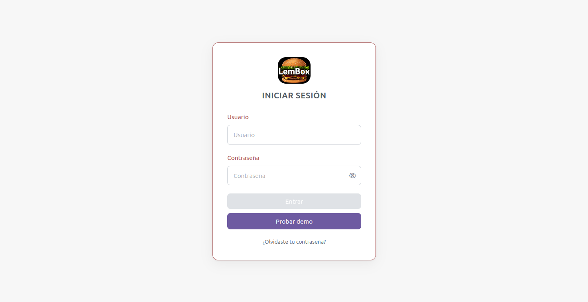 | 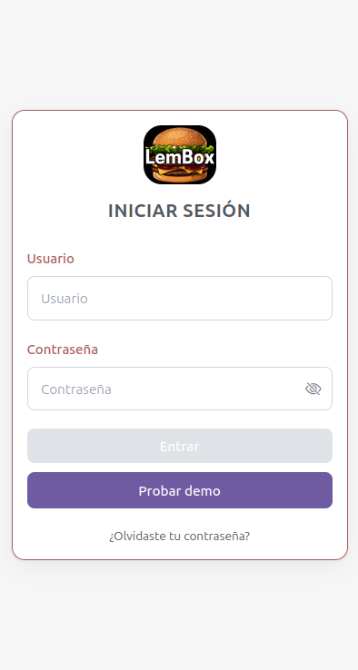 |

### 📊 Dashboard

|                                   |                                    |
| --------------------------------- | ---------------------------------- |
| 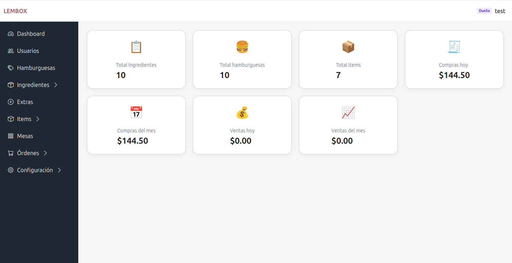 | 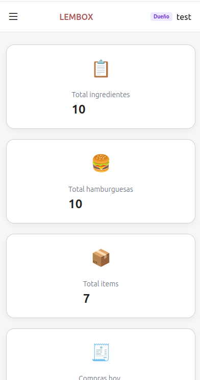 |

### 👥 Usuarios

|                               |                                |
| ----------------------------- | ------------------------------ |
| 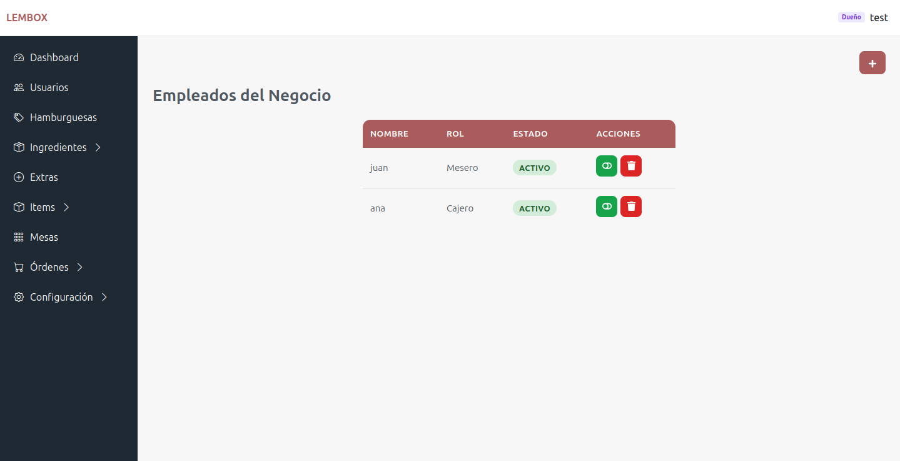 | 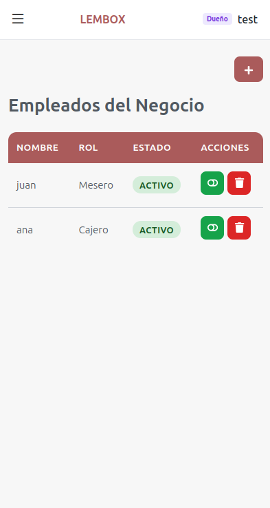 |

### 🍔 Catálogo de hamburguesas

|                                 |                                  |
| ------------------------------- | -------------------------------- |
| 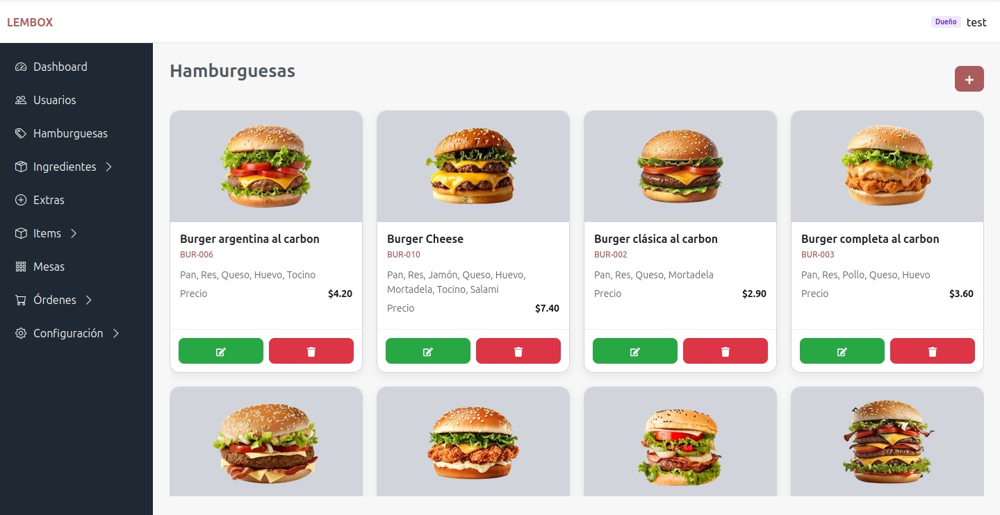 | 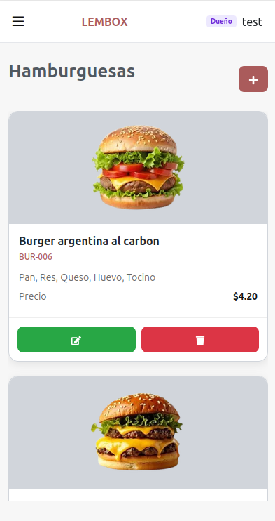 |

### 🥩 Catálogo de Ingredientes

|                                     |                                      |
| ----------------------------------- | ------------------------------------ |
| 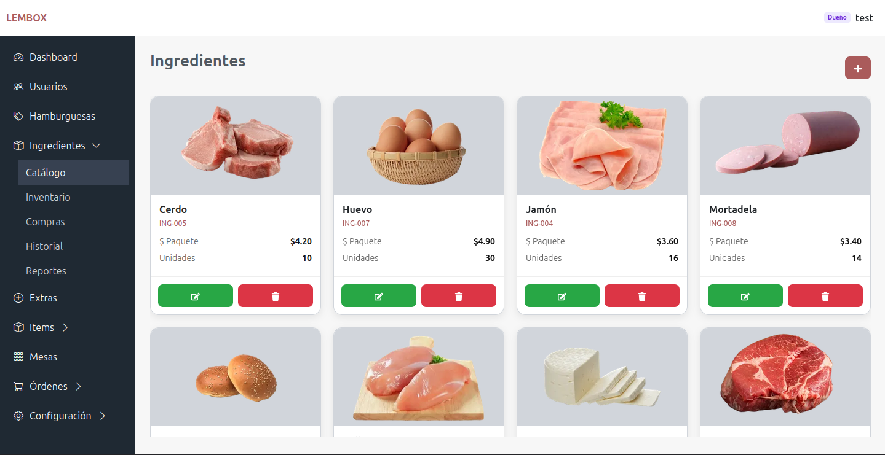 | 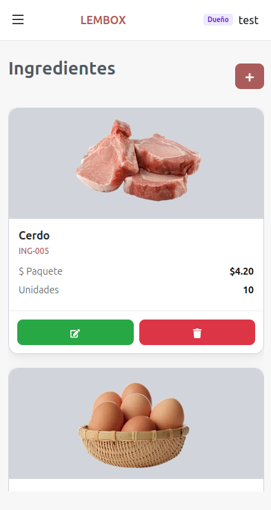 |

### 🥤 Productos adicionales

|                               |                                |
| ----------------------------- | ------------------------------ |
| 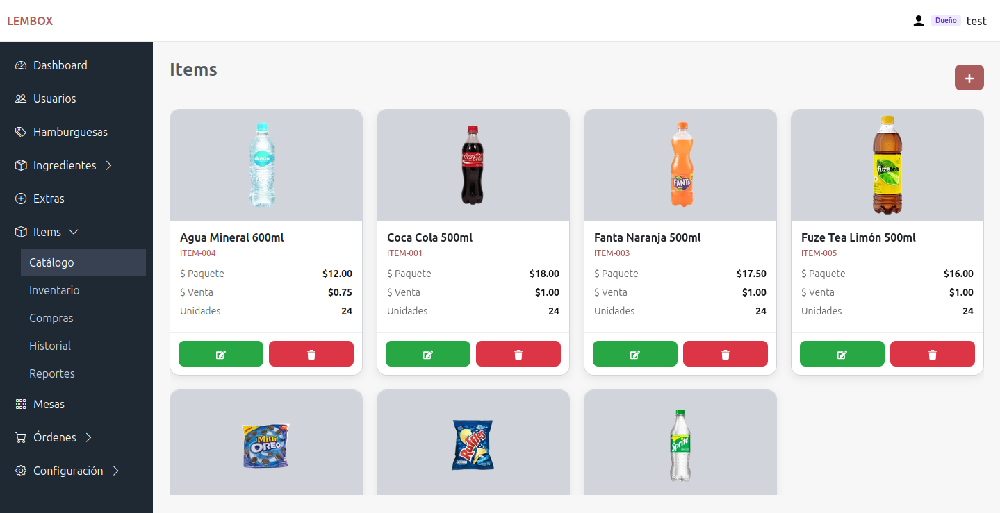 | 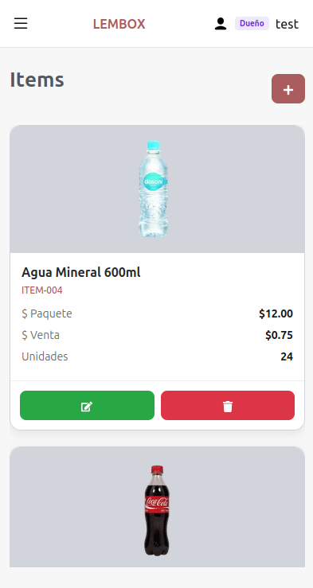 |

### ➕ Catálogo de Extras

|                                |                                 |
| ------------------------------ | ------------------------------- |
| 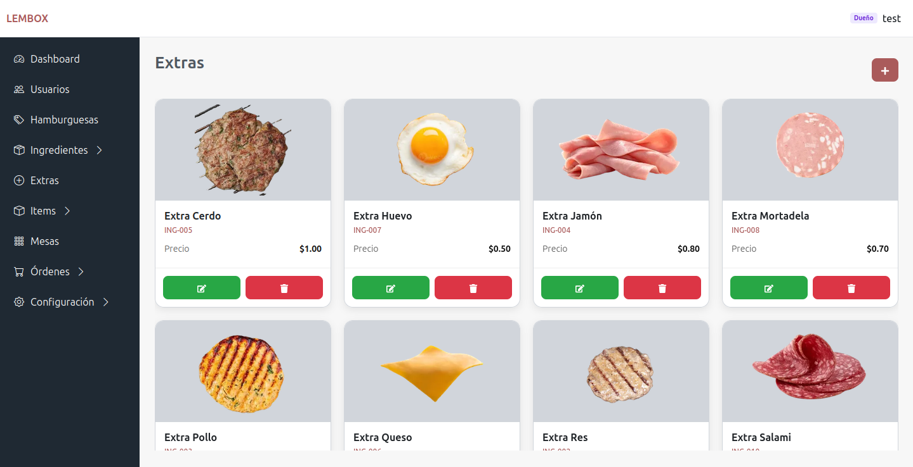 | 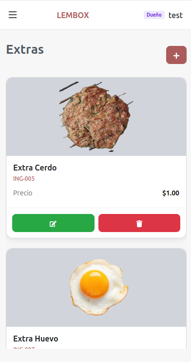 |

### 🪑 Mesas

|                               |                                |
| ----------------------------- | ------------------------------ |
| 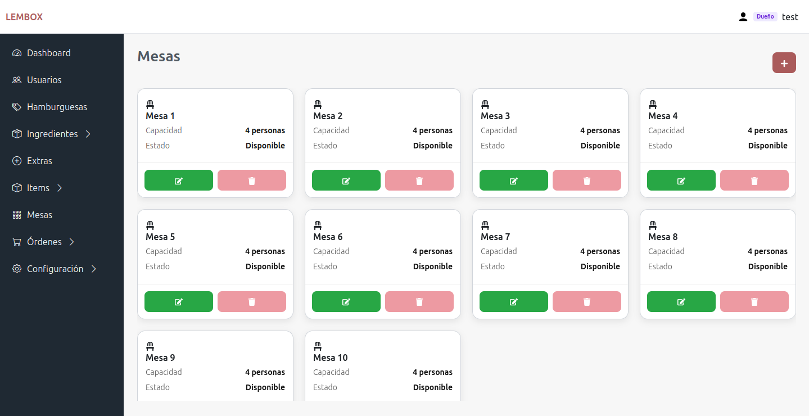 | 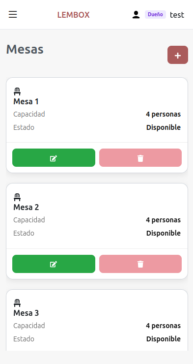 |

### 📝 Órdenes

|                                 |                                  |
| ------------------------------- | -------------------------------- |
| 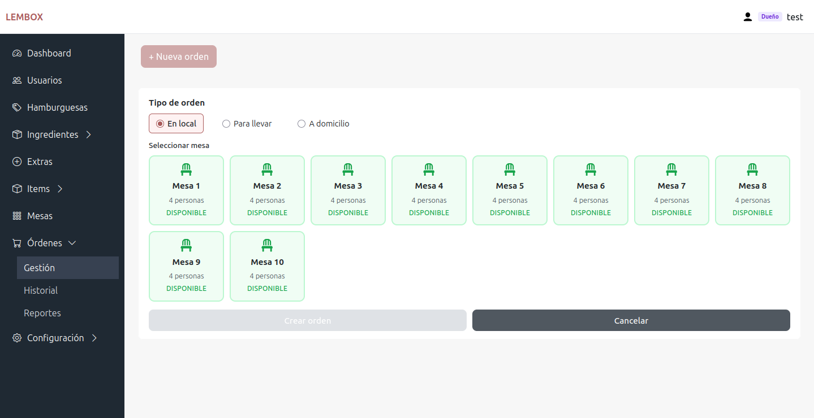 | 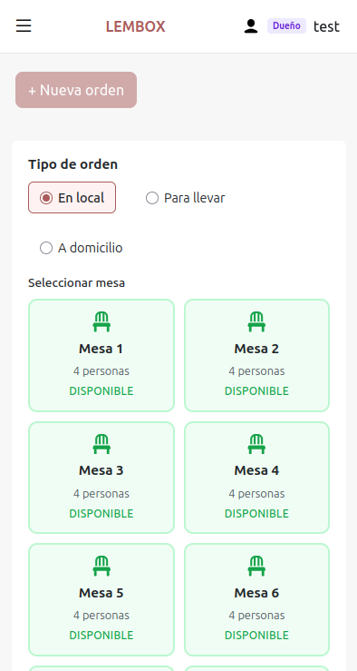 |

### 💳 Pago de órdenes

|                                  |                                   |
| -------------------------------- | --------------------------------- |
| 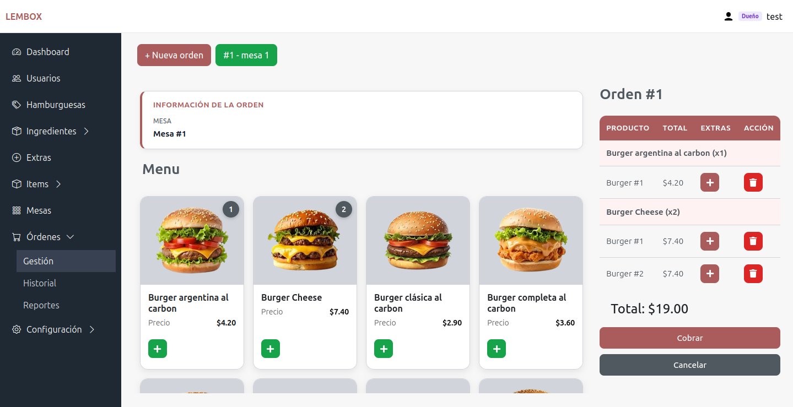 | 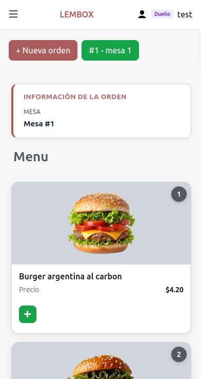 |

...

## ⚙️ Módulos principales

Autenticación

- Login seguro
- Protección de rutas

Usuarios

- Gestión por negocio
- Roles y permisos

Hamburguesas

- Catálogo basado en recetas
- Relación con ingredientes

Ingredientes

- Inventario automático
- Control de stock mínimo

Compras

- Registro de reposición
- Actualización automática

Órdenes y ventas

- Flujo completo de pedido a pago
- Historial de ventas

Reportes

- Ventas por periodo
- Resúmenes generales

---

## 📈 Calidad y escalabilidad

- Arquitectura modular por dominio
- Backend desacoplado
- Código mantenible
- Preparado para crecimiento SaaS
- Pruebas automatizadas E2E

---

## 🚀 Escalabilidad futura

Diseñado para crecer sin refactorizaciones grandes.

---

## 👨‍💻 Autor

Limbert Emanuel Molina Intriago.

---

## 📄 Licencia

**Copyright © 2026 Limbert Molina.**

Todos los derechos reservados.

Este proyecto es software propietario. No está permitido copiar, modificar, distribuir o utilizar este software, total o parcialmente, sin la autorización previa y por escrito del autor.

---
